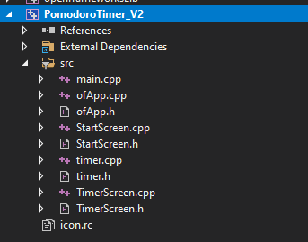
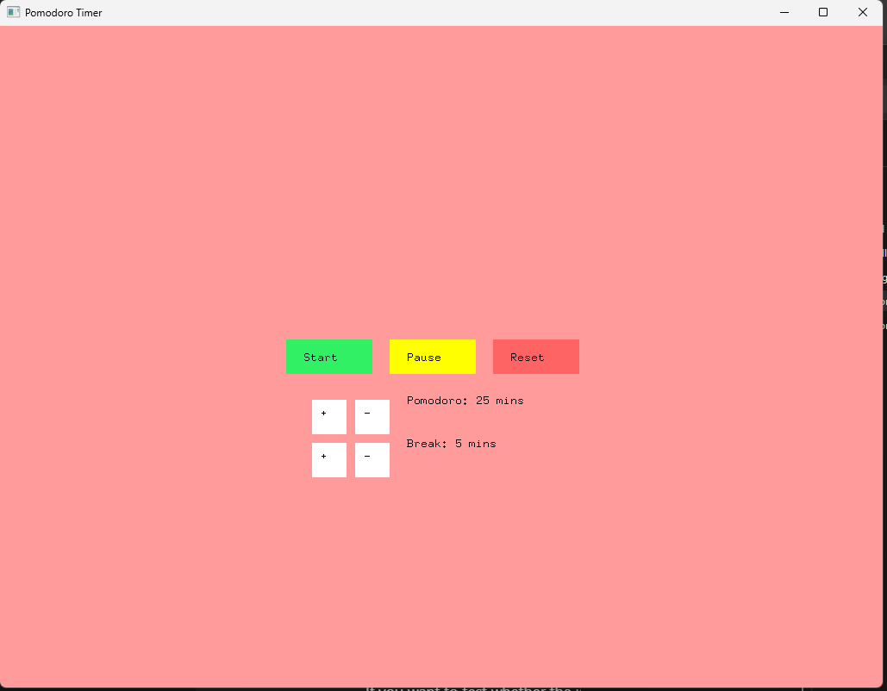
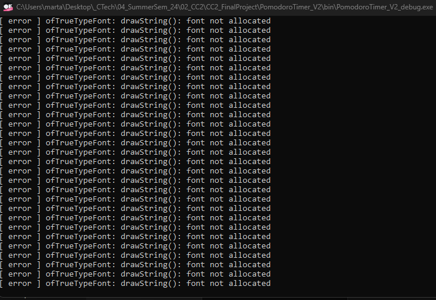
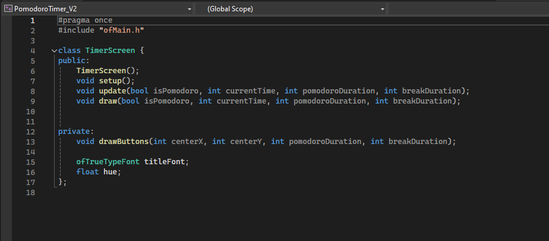
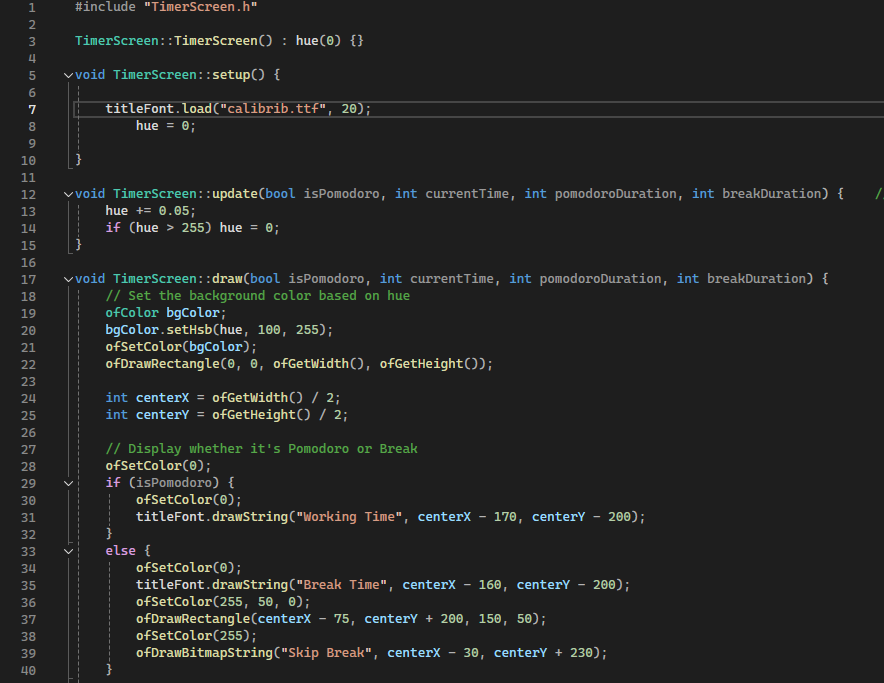
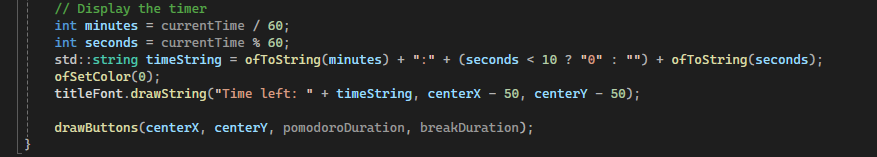
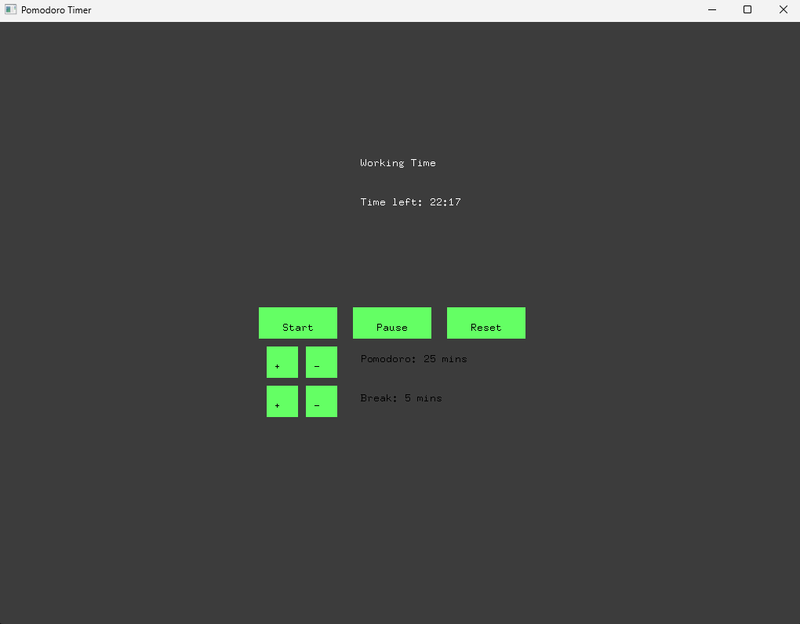
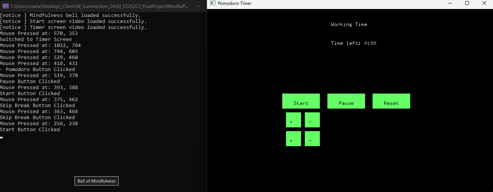

# Final Project

### 1. Project Overview

This project is a Pomodoro timer with an integrated mindfulness feature,developed using C++. It combines the productivity-focused Pomodoro technique with elements of mindfulness, such as customizable timers and a mindfulness bell, to encourage users to stay focused while maintaining a sense of calm. The goal is to create a tool that helps users manage their time effectively while incorporating mindfulness practice, supporting both productivity and mental well-being.

User Testing: For testing prupose, the timer is run by seconds instead of mins to let user try the functions easier and quicker. The second can be easier changed to min in the code. 

### 2. Inspiration
The concept of the mindfulness bell was created by Zen master Thich Nhat Hanh and is used in Plum Village Monastery in southwest France. I first experienced it during a meditation retreat there. Throughout the retreat, the sound of a bell would ring from time to time, and everyone would stop—conversations paused, and all movement ceased. The bell serves as a reminder to take a few mindful breaths and return to a calm, present state. This practice had a deep impact on me, helping me step out of the constant rush of daily life.

Since then, I’ve been using a digital version of the mindfulness bell installed in my browser, which rings hourly as a reminder to return to the present moment. At the same time, I use a Pomodoro timer for productivity and time management. Combining these two tools felt like a natural step.

Inspiration for the starting page

### 3. Goals
Before diving into the code, I outlined the user functions and visual elements for the Pomodoro timer project. As a beginner in C++, my primary goal is to keep the application simple, focusing on learning the coding environment and syntax while ensuring core functionalities work. I will integrate mindfulness elements and aim to complete some bonus features if time allows.

*  User Functions
   - Users can start a 25-minute pomodoro timer, and the bell will go off when the time elapses.
   - Users can reset the timer for the next Pomodoro session.
   - User can customise the length of each pomodoro and each break.
   - Users can skip break time.
   - (Bonus) Users can toggle sound on/off or choose different sounds.
   - (Bonus) Implement animations that evolve over time.
   - (Bonus) Display finished time slots.

*  Code Principe
    - Clicking anywhere on the start page will navigate to the timer screen.
   - The timer toggles between starting and pausing with the ‘start’ and ‘pause’ button.
   - The bell rings when the timer reaches zero.
   - Each work session is followed by a break session.
   - Users can modify work and break durations.
   - The ‘Reset’ button resets the timer.
   - The ‘Skip Break’ button skips the break.

### 4. Design and System Overview

* Visual and Interface Design:

    * The start screen features a calming looping video background.
    * The timer screen includes smooth color transitions to support mindfulness and indicates whether the user is in work or break time.
    * Interface elements include simple buttons, a timer, and the sound of a mindfulness bell for time alerts.

* User Interaction:

    * Users can adjust Pomodoro and break durations using + and - buttons.
    * The timer includes start, pause, skip break, and reset functionalities.
    * The mindfulness bell rings at the end of work and break sessions, encouraging users to pause and breathe.

### 5. Code Structure and Design

I aimed to keep the code simple and modular by organizing it into separate classes for timer logic, start screen, and timer screen.
The original plan was to divide these components. 

However,I ran into a problem with loading the font after separating the code. I tried different solutions, like changing the font and using absolute paths, but nothing worked. This caused the titles "Working Time/Break Time" and "Time Left: 25:00" to not show up, as shown in the screenshot.
I spent a significant amount of time troubleshooting this issue. Eventually, I decided to move on and focus on getting the timer logic right. 

### 6. Challenges
* UI Elements

Designing the user interface was unexpectedly challenging. Aligning multiple elements, such as the timer display, buttons, and time settings, was not intuitive in C++ for me.   The UI design was complex, and I found it difficult to achieve precise alignment. 
In the furtue, I would explore addons or plugins to see if there's any way to simplify UI design. It’s not perfect yet, but my focus was on developing a functional app rather than achieving perfect aesthetics.

The texts and buttons are not aligned.

* Video Loading Issues

The original idea included two looping videos to create a calming atmosphere. While the video on the start screen worked fine, the video on the timer screen only displayed a black screen. Alought spedning lof of time debugging and getting assistance from ChatGPT, the issue was not fixed. I suspect the problem was that both videos were loaded simultaneously at the start, as shown in the picture below. Ultimately, I spent too much time trying to fix it, so as a workaround, I replaced the timer screen’s video with a smooth color transition.

* Time Logic
  
The biggest challenge was handling the adjustable Pomodoro and break durations. Synchronizing the timer display when users changing the time duration and transitions between work and break times required plenty of troubleshooting. For this part,online resources weren't helpful, I used ChatGPT for specific time logic solutions.

* Future Improvements
  
The UI can be enhanced with animations that evolve over time to make the app more engaging. Additional features could include options to toggle sound effects, display completed time slots, and show the current project. Besides, I would spend more time to fix the bug of sperating classes. 

### 7. Conclusion

The app is functional but still rough in aesthetics and functionality. I’m pleased with the progress made within the time constraints, especially as a beginner. Although I prefer visual-oriented programming and may not continue with C++, learning C++ has been valuable for understanding programming logic and fundamentals, which I can apply to other programming environments.